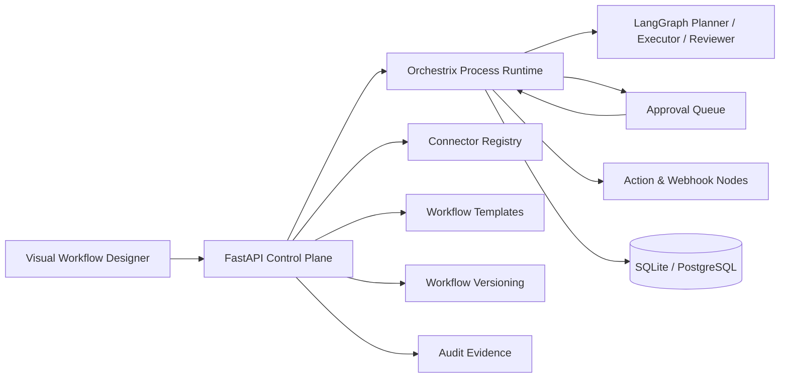

# Orchestrix AI

[](https://github.com/fullstackwithai/orchestrix-ai/actions/workflows/ci.yml)


**Orchestrix AI** is an enterprise workflow automation and governed AI-agent orchestration platform inspired by the most practical ideas from n8n, Zapier, LangGraph, and BPMN.

It combines a visual workflow designer, persistent process versions, stateful execution, actual LangGraph-backed AI nodes, human approvals, execution history, connector discovery, reusable templates, and auditable evidence in one portfolio-grade system.

## Why this project is different

Most AI portfolio projects stop at a chat interface. Orchestrix demonstrates broader engineering ownership:

- visual process modeling
- actual LangGraph-backed planner, executor, and reviewer orchestration
- connector registry with available and planned integrations
- reusable workflow template catalog
- graph execution and state transitions
- BPMN-inspired gateways and human tasks
- AI-agent nodes with deterministic offline behavior and optional OpenAI integration
- human-in-the-loop governance
- workflow versioning
- resumable approval-based execution
- persistent run history
- audit evidence
- FastAPI APIs, SQLAlchemy persistence, Docker, testing, and CI

## Signature workflow

```text
Lead webhook
→ validate lead
→ AI qualifies opportunity
→ manager approval
→ approved: send proposal
→ rejected: record rejection
→ complete with audit trail
```

## Architecture



## Supported node types

| Node | Purpose |
|---|---|
| Trigger | Starts a workflow |
| Action | Writes deterministic state |
| Condition | BPMN-style routing gateway |
| AI Agent | Runs a governed LangGraph planner → executor → reviewer cycle |
| Human Approval | Pauses execution for an auditable decision |
| Delay | Represents a timer or wait state |
| Webhook | Models external integration calls |
| End | Completes the process |

## Phase 2 capabilities

### Governed LangGraph orchestration

AI nodes use a three-stage LangGraph flow:

```text
Planner → Executor → Reviewer
```

The executor can call OpenAI when a key is configured or use deterministic offline output for reproducible demos and CI. The reviewer explicitly records whether output exists and should remain behind human approval.

### Connector registry

The API exposes integration readiness for Webhook, PostgreSQL, OpenAI, Gmail, Slack, GitHub, and Google Sheets. Available connectors are distinguished from planned connectors instead of being falsely presented as completed.

### Workflow templates

The template catalog includes:

- AI Sales Proposal Automation
- AI Support Escalation
- Security Incident Triage

## Quick start

```bash
python -m venv .venv

# Windows
.venv\Scripts\activate

# macOS/Linux
source .venv/bin/activate

pip install -r requirements.txt
uvicorn app.main:app --reload
```

Open `http://localhost:8000`. Interactive API documentation is available at `/docs`.

## Demo flow

1. Open the seeded **AI Sales Proposal Automation** workflow.
2. Drag nodes to inspect the visual designer.
3. Select the AI node and approval node to review governance roles.
4. Run the workflow.
5. Open **Human Approvals** and approve or reject the proposal.
6. Review the completed run and immutable audit evidence.
7. Inspect `/api/connectors` and `/api/templates`.
8. Save the canvas to create a new workflow version.

## API surface

| Method | Endpoint | Purpose |
|---|---|---|
| `GET` | `/api/health` | Runtime and AI mode |
| `GET` | `/api/dashboard` | Operational metrics |
| `GET` | `/api/connectors` | Connector registry and readiness |
| `GET` | `/api/templates` | Workflow template catalog |
| `GET/POST` | `/api/workflows` | List and create workflows |
| `GET/PUT` | `/api/workflows/{id}` | Inspect and version workflows |
| `POST` | `/api/workflows/{id}/run` | Execute a workflow |
| `GET` | `/api/runs` | Execution history |
| `GET` | `/api/approvals` | Human task queue |
| `POST` | `/api/approvals/{id}/decision` | Approve or reject and resume |
| `GET` | `/api/audit` | Audit evidence |

## Engineering decisions

- Workflow definitions are validated as typed graph structures.
- Every saved edit creates a new immutable workflow version.
- Human approval nodes pause execution instead of simulating approval.
- Approval decisions resume the same persisted run.
- AI output is bounded behind a planner, executor, and reviewer graph.
- Offline mode remains deterministic for local demos and automated tests.
- Execution and approval events generate audit records.
- Connector and template status is explicit and evidence-based.

## Current scope

This is a serious portfolio MVP, not a production replacement for n8n, Zapier, Temporal, or a complete BPMN 2.0 engine.

Production hardening would include authentication, RBAC, tenant isolation, encrypted secrets, PostgreSQL migrations, a durable queue, idempotency keys, worker processes, operational external connectors, OpenTelemetry, rate limiting, and policy enforcement.

## Testing

```bash
pytest -q
```

The expanded suite validates:

- runtime health
- workflow graph structure
- AI and human-task nodes
- execution pause at approval
- approval-based resumption
- workflow versioning
- audit evidence
- connector discovery
- workflow templates
- governed graph execution

## Portfolio ownership

Designed and implemented by **Arsim Shefkiu**  
AI Software Engineer | Full-Stack Developer | SaaS & Automation  
**DesignHubMK:** [www.designhubmk.com](https://www.designhubmk.com)
